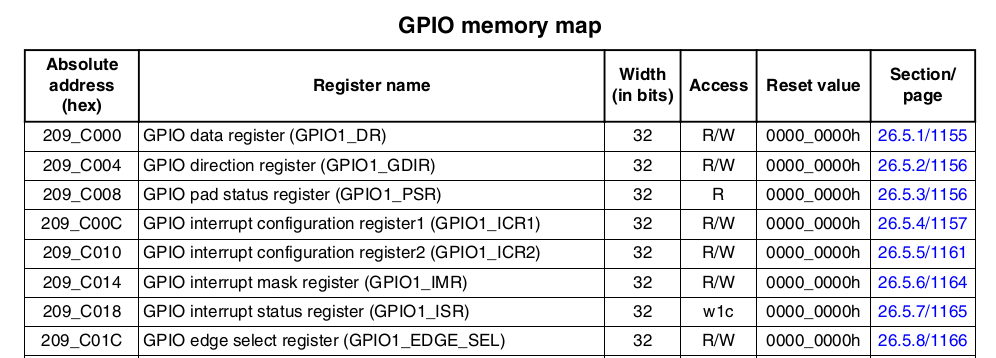

i.mx6ul GPIO點亮Led (hello world)
===

## (1)看電路圖

## (2)啟動指定GPIO clock

_這裡只enable gpio1_clk_enable 和 iomuxc_clk_enable結果不成功
CCM_CCGR1,先把全部clock gate enable,之後再研究._  

    Reg:     CCM_CCGR1
    Address: 0x020C406C  
    Value:   0x0A000000  
    bit 27-26 gpio1 clock (gpio1_clk_enable)  

    Reg:     CCM_CCGR4  
    Address: 0x020C4078  
    Value:   0x0000000A  
    bit 3-2 |iomuxc clock (iomuxc_clk_enable)

## (3)MUX多工器複用

查詢i.MX 6UltraLite Applications Processor Reference Manual

    Reg:IOMUXC_SW_MUX_CTL_PAD_GPIO1_IO03
    Address:0x020E0000+68h = 0x020E_0068
    value: 0x5

    bit 4  | 0
    bit 3-0| 0101

    選擇 ALT5 GPIO1_IO03

<!--
|    寄存器	                    |地址	        |設定值  |	說明                |
|-------------------------------|---------------|--------|----------------------|
|IOMUXC_SW_MUX_CTL_PAD_GPIO1_IO03|	`0x020E0068`|	`0x5`  |	選擇 ALT5 GPIO1_IO03|
-->

## (4)設置PAD電氣屬性 -初始化GPIO 輸出功能 上拉 速度 etc.
p1588

    Reg:     IOMUXC_SW_MUX_CTL_PAD_GPIO1_IO03
    Address: 0x020E0000+2F4h = 0x020E_02F4
    value:   0x01B0

<!--
|    寄存器	                    |地址	        |設定值  |	說明                |
|-------------------------------|---------------|--------|----------------------|
|IOMUXC_SW_MUX_CTL_PAD_GPIO1_IO03|	`0x02E02F4` |	`0x5`  |	選擇 ALT5 GPIO1_IO03|
-->
    bit [16]:0      HYS關閉 
    bit [15-14]:00  下拉
    bit [13]:0      keeper功能
    bit [12]:1      pull/keeper啟動
    bit [11]:0      關閉開路輸出
    bit [7:6]:10    速度100MHz
    bit [5:3]:110   R0/R6驅動能力
    bit [0]:        低slew rate

## (5)設置GPIO

GPIO有8個暫存器  
設置GPIO1_GDIR 的IO03為輸出

    Address:0x0209C004
    value: 0x8

只設置GPIO1_IO03為輸出

使用make編譯
或下make led_as.bin 編譯組合語言版

裸機使用C語言要先進到SVC並設置sp(start.S),並使用連結指令稿(imx6ul.lds)確保start.S連結到開頭0x87800000

ref: 
 >   i.MX 6UltraLite Applications Processor Reference Manual, Rev. 1